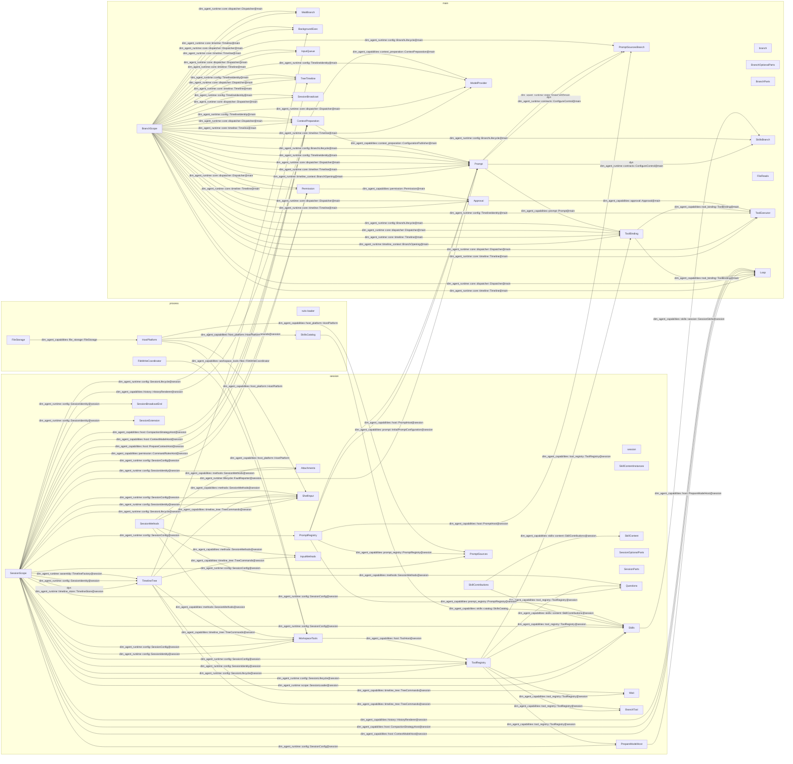

# 本地执行运行组合

由真实 rutis 装配 `defaults::install_local_execution` 生成（模型为脚本化 mock）。重新生成：`cargo run -p xtask -- graph`。

```mermaid
%% Generated from live rutis diagnostics; do not edit.
flowchart LR
  subgraph main["main"]
    p33["branch"]
    p36["BranchOptionalParts"]
    p35["BranchParts"]
    p52["SkillsBranch"]
    p51["PromptSourcesBranch"]
    p50["WaitBranch"]
    p49["BackgroundExec"]
    p48["FileReads"]
    p47["ToolExecutor"]
    p46["ToolBinding"]
    p45["Approval"]
    p44["Permission"]
    p43["ModelProvider"]
    p42["Loop"]
    p41["InputQueue"]
    p40["Prompt"]
    p39["ContextPreparation"]
    p38["TreeTimeline"]
    p37["SessionBroadcast"]
    p34["BranchScope"]
  end
  subgraph process["process"]
    p6["rutis-loader"]
    p5["FileWriteCoordinator"]
    p4["SkillsCatalog"]
    p3["HostPlatform"]
    p2["FileStorage"]
  end
  subgraph session["session"]
    p10["session"]
    p31["SkillContentInstances"]
    p32["SkillContent"]
    p14["SessionOptionalParts"]
    p13["SessionParts"]
    p30["Questions"]
    p29["Attachments"]
    p28["Skills"]
    p27["SkillContributions"]
    p26["PromptSources"]
    p25["PromptRegistry"]
    p24["ShellInput"]
    p23["Wait"]
    p22["WorkspaceTools"]
    p21["BranchTool"]
    p20["ToolRegistry"]
    p19["InputMethods"]
    p18["SessionMethods"]
    p17["TimelineTree"]
    p16["SessionBroadcastEnd"]
    p15["PrepareModelHost"]
    p12["SessionExtension"]
    p11["SessionScope"]
  end
  p28 -->|"dim_agent_capabilities::skills::session::SessionSkills@session"| p52
  p34 -->|"dim_agent_runtime::config::BranchLifecycle@main"| p52
  p40 -->|"dyn dim_agent_runtime::contracts::ConfigureControl@main"| p52
  p25 -->|"dim_agent_capabilities::host::PromptHost@session"| p51
  p34 -->|"dim_agent_runtime::config::BranchLifecycle@main"| p51
  p40 -->|"dim_agent_runtime::state::StateCell<dim_agent_capabilities::prompt_state::PromptSnapshot>@main"| p51
  p40 -->|"dyn dim_agent_runtime::contracts::ConfigureControl@main"| p51
  p34 -->|"dim_agent_runtime::core::dispatcher::Dispatcher@main"| p50
  p34 -->|"dim_agent_runtime::core::timeline::Timeline@main"| p50
  p11 -->|"dim_agent_runtime::config::SessionLifecycle@session"| p49
  p34 -->|"dim_agent_runtime::core::dispatcher::Dispatcher@main"| p49
  p34 -->|"dim_agent_runtime::core::timeline::Timeline@main"| p49
  p45 -->|"dim_agent_capabilities::approval::Approval@main"| p47
  p46 -->|"dim_agent_capabilities::tool_binding::ToolBinding@main"| p47
  p34 -->|"dim_agent_runtime::config::TimelineIdentity@main"| p47
  p34 -->|"dim_agent_runtime::core::dispatcher::Dispatcher@main"| p47
  p34 -->|"dim_agent_runtime::core::timeline::Timeline@main"| p47
  p40 -->|"dim_agent_capabilities::prompt::Prompt@main"| p46
  p20 -->|"dim_agent_capabilities::tool_registry::ToolRegistry@session"| p46
  p34 -->|"dim_agent_runtime::config::BranchLifecycle@main"| p46
  p34 -->|"dim_agent_runtime::core::dispatcher::Dispatcher@main"| p46
  p34 -->|"dim_agent_runtime::core::timeline::Timeline@main"| p46
  p34 -->|"dim_agent_runtime::timeline_context::BranchOpening@main"| p46
  p44 -->|"dim_agent_capabilities::permission::Permission@main"| p45
  p34 -->|"dim_agent_runtime::core::dispatcher::Dispatcher@main"| p45
  p34 -->|"dim_agent_runtime::core::timeline::Timeline@main"| p45
  p11 -->|"dim_agent_capabilities::permission::CommandRulesHost@session"| p44
  p11 -->|"dim_agent_runtime::config::SessionConfig@session"| p44
  p34 -->|"dim_agent_runtime::core::dispatcher::Dispatcher@main"| p44
  p34 -->|"dim_agent_runtime::core::timeline::Timeline@main"| p44
  p39 -->|"dim_agent_capabilities::context_preparation::ContextPreparation@main"| p43
  p34 -->|"dim_agent_runtime::config::TimelineIdentity@main"| p43
  p34 -->|"dim_agent_runtime::core::dispatcher::Dispatcher@main"| p43
  p34 -->|"dim_agent_runtime::core::timeline::Timeline@main"| p43
  p11 -->|"dim_agent_capabilities::history::HistoryRenderer@session"| p42
  p11 -->|"dim_agent_capabilities::host::CompactionStrategyHost@session"| p42
  p11 -->|"dim_agent_capabilities::host::ContextModelHost@session"| p42
  p15 -->|"dim_agent_capabilities::host::PrepareModelHost@session"| p42
  p46 -->|"dim_agent_capabilities::tool_binding::ToolBinding@main"| p42
  p34 -->|"dim_agent_runtime::core::dispatcher::Dispatcher@main"| p42
  p34 -->|"dim_agent_runtime::core::timeline::Timeline@main"| p42
  p34 -->|"dim_agent_runtime::core::dispatcher::Dispatcher@main"| p41
  p34 -->|"dim_agent_runtime::core::timeline::Timeline@main"| p41
  p39 -->|"dim_agent_capabilities::context_preparation::ConfigurationPublisher@main"| p40
  p25 -->|"dim_agent_capabilities::host::PromptHost@session"| p40
  p25 -->|"dim_agent_capabilities::prompt::InitialPromptConfiguration@session"| p40
  p34 -->|"dim_agent_runtime::config::BranchLifecycle@main"| p40
  p34 -->|"dim_agent_runtime::config::TimelineIdentity@main"| p40
  p34 -->|"dim_agent_runtime::core::dispatcher::Dispatcher@main"| p40
  p34 -->|"dim_agent_runtime::core::timeline::Timeline@main"| p40
  p11 -->|"dim_agent_runtime::lifecycle::FaultReporter@session"| p40
  p34 -->|"dim_agent_runtime::timeline_context::BranchOpening@main"| p40
  p11 -->|"dim_agent_capabilities::history::HistoryRenderer@session"| p39
  p11 -->|"dim_agent_capabilities::host::CompactionStrategyHost@session"| p39
  p11 -->|"dim_agent_capabilities::host::ContextModelHost@session"| p39
  p11 -->|"dim_agent_capabilities::host::PrepareContextHost@session"| p39
  p34 -->|"dim_agent_runtime::config::TimelineIdentity@main"| p39
  p34 -->|"dim_agent_runtime::core::dispatcher::Dispatcher@main"| p39
  p34 -->|"dim_agent_runtime::core::timeline::Timeline@main"| p39
  p17 -->|"dim_agent_capabilities::timeline_tree::TreeCommands@session"| p38
  p34 -->|"dim_agent_runtime::config::TimelineIdentity@main"| p38
  p34 -->|"dim_agent_runtime::core::dispatcher::Dispatcher@main"| p38
  p34 -->|"dim_agent_runtime::core::timeline::Timeline@main"| p38
  p34 -->|"dim_agent_runtime::config::TimelineIdentity@main"| p37
  p34 -->|"dim_agent_runtime::core::dispatcher::Dispatcher@main"| p37
  p3 -->|"dim_agent_capabilities::host_platform::HostPlatform"| p4
  p2 -->|"dim_agent_capabilities::file_storage::FileStorage"| p3
  p27 -->|"dim_agent_capabilities::skills::content::SkillContributions@session"| p32
  p18 -->|"dim_agent_capabilities::methods::SessionMethods@session"| p30
  p20 -->|"dim_agent_capabilities::tool_registry::ToolRegistry@session"| p30
  p11 -->|"dim_agent_runtime::config::SessionConfig@session"| p30
  p18 -->|"dim_agent_capabilities::methods::SessionMethods@session"| p29
  p11 -->|"dim_agent_runtime::config::SessionIdentity@session"| p29
  p25 -->|"dim_agent_capabilities::prompt_registry::PromptRegistry@session"| p28
  p4 -->|"dim_agent_capabilities::skills::catalog::SkillsCatalog"| p28
  p27 -->|"dim_agent_capabilities::skills::content::SkillContributions@session"| p28
  p20 -->|"dim_agent_capabilities::tool_registry::ToolRegistry@session"| p28
  p11 -->|"dim_agent_runtime::config::SessionConfig@session"| p28
  p11 -->|"dim_agent_runtime::config::SessionLifecycle@session"| p28
  p11 -->|"dim_agent_runtime::scope::SessionLoader@session"| p28
  p3 -->|"dim_agent_capabilities::host_platform::HostPlatform"| p26
  p25 -->|"dim_agent_capabilities::prompt_registry::PromptRegistry@session"| p26
  p11 -->|"dim_agent_runtime::config::SessionConfig@session"| p26
  p11 -->|"dim_agent_runtime::config::SessionConfig@session"| p25
  p3 -->|"dim_agent_capabilities::host_platform::HostPlatform"| p24
  p18 -->|"dim_agent_capabilities::methods::SessionMethods@session"| p24
  p17 -->|"dim_agent_capabilities::timeline_tree::TreeCommands@session"| p24
  p11 -->|"dim_agent_runtime::config::SessionConfig@session"| p24
  p11 -->|"dim_agent_runtime::config::SessionIdentity@session"| p24
  p11 -->|"dim_agent_runtime::config::SessionLifecycle@session"| p24
  p17 -->|"dim_agent_capabilities::timeline_tree::TreeCommands@session"| p23
  p20 -->|"dim_agent_capabilities::tool_registry::ToolRegistry@session"| p23
  p3 -->|"dim_agent_capabilities::host_platform::HostPlatform"| p22
  p18 -->|"dim_agent_capabilities::methods::SessionMethods@session"| p22
  p17 -->|"dim_agent_capabilities::timeline_tree::TreeCommands@session"| p22
  p5 -->|"dim_agent_capabilities::workspace_tools::files::FileWriteCoordinator"| p22
  p11 -->|"dim_agent_runtime::config::SessionConfig@session"| p22
  p11 -->|"dim_agent_runtime::config::SessionIdentity@session"| p22
  p17 -->|"dim_agent_capabilities::timeline_tree::TreeCommands@session"| p21
  p20 -->|"dim_agent_capabilities::tool_registry::ToolRegistry@session"| p21
  p22 -->|"dim_agent_capabilities::host::ToolHost@session"| p20
  p11 -->|"dim_agent_runtime::config::SessionConfig@session"| p20
  p11 -->|"dim_agent_runtime::config::SessionIdentity@session"| p20
  p11 -->|"dim_agent_runtime::config::SessionLifecycle@session"| p20
  p18 -->|"dim_agent_capabilities::methods::SessionMethods@session"| p19
  p17 -->|"dim_agent_capabilities::timeline_tree::TreeCommands@session"| p19
  p11 -->|"dim_agent_runtime::assembly::TimelineFactory@session"| p17
  p11 -->|"dim_agent_runtime::config::SessionIdentity@session"| p17
  p11 -->|"dyn dim_agent_runtime::timeline_store::TimelineStore@session"| p17
  p11 -->|"dim_agent_runtime::config::SessionIdentity@session"| p16
  p20 -->|"dim_agent_capabilities::tool_registry::ToolRegistry@session"| p15
  p11 -->|"dim_agent_runtime::config::SessionConfig@session"| p15
  p11 -->|"dim_agent_runtime::config::SessionIdentity@session"| p12
```
