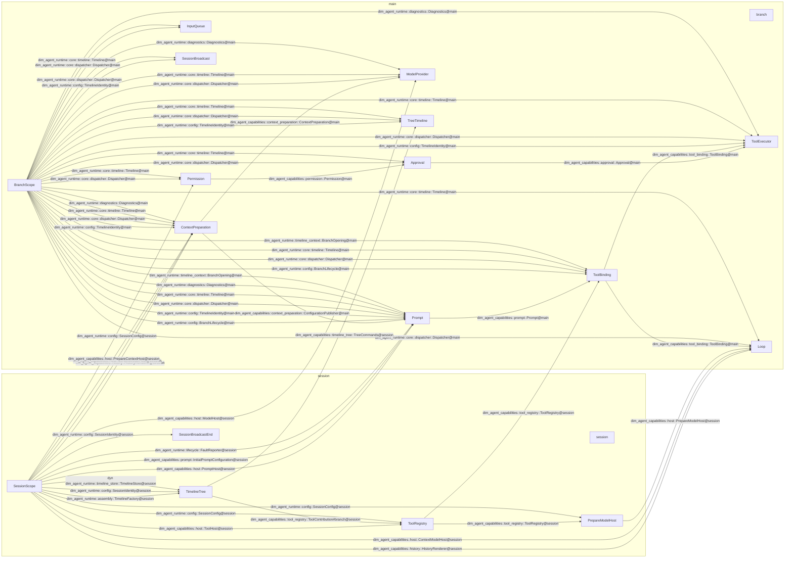

# 默认运行组合

由真实 rutis 装配生成。重新生成：`cargo run -p xtask -- graph`。

```mermaid
%% Generated from live rutis diagnostics; do not edit.
flowchart LR
  subgraph main["main"]
    p11["branch"]
    p23["ToolExecutor"]
    p22["ToolBinding"]
    p21["Approval"]
    p20["Permission"]
    p19["ModelProvider"]
    p18["Loop"]
    p17["InputQueue"]
    p16["Prompt"]
    p15["ContextPreparation"]
    p14["TreeTimeline"]
    p13["SessionBroadcast"]
    p12["BranchScope"]
  end
  subgraph session["session"]
    p5["session"]
    p10["ToolRegistry"]
    p9["TimelineTree"]
    p8["SessionBroadcastEnd"]
    p7["PrepareModelHost"]
    p6["SessionScope"]
  end
  p21 -->|"dim_agent_capabilities::approval::Approval@main"| p23
  p22 -->|"dim_agent_capabilities::tool_binding::ToolBinding@main"| p23
  p12 -->|"dim_agent_runtime::config::TimelineIdentity@main"| p23
  p12 -->|"dim_agent_runtime::core::dispatcher::Dispatcher@main"| p23
  p12 -->|"dim_agent_runtime::core::timeline::Timeline@main"| p23
  p12 -->|"dim_agent_runtime::diagnostics::Diagnostics@main"| p23
  p16 -->|"dim_agent_capabilities::prompt::Prompt@main"| p22
  p10 -->|"dim_agent_capabilities::tool_registry::ToolRegistry@session"| p22
  p12 -->|"dim_agent_runtime::config::BranchLifecycle@main"| p22
  p12 -->|"dim_agent_runtime::core::dispatcher::Dispatcher@main"| p22
  p12 -->|"dim_agent_runtime::core::timeline::Timeline@main"| p22
  p12 -->|"dim_agent_runtime::timeline_context::BranchOpening@main"| p22
  p20 -->|"dim_agent_capabilities::permission::Permission@main"| p21
  p12 -->|"dim_agent_runtime::core::dispatcher::Dispatcher@main"| p21
  p12 -->|"dim_agent_runtime::core::timeline::Timeline@main"| p21
  p6 -->|"dim_agent_runtime::config::SessionConfig@session"| p20
  p12 -->|"dim_agent_runtime::core::dispatcher::Dispatcher@main"| p20
  p12 -->|"dim_agent_runtime::core::timeline::Timeline@main"| p20
  p15 -->|"dim_agent_capabilities::context_preparation::ContextPreparation@main"| p19
  p6 -->|"dim_agent_capabilities::host::ModelHost@session"| p19
  p12 -->|"dim_agent_runtime::core::dispatcher::Dispatcher@main"| p19
  p12 -->|"dim_agent_runtime::core::timeline::Timeline@main"| p19
  p12 -->|"dim_agent_runtime::diagnostics::Diagnostics@main"| p19
  p6 -->|"dim_agent_capabilities::history::HistoryRenderer@session"| p18
  p6 -->|"dim_agent_capabilities::host::ContextModelHost@session"| p18
  p7 -->|"dim_agent_capabilities::host::PrepareModelHost@session"| p18
  p22 -->|"dim_agent_capabilities::tool_binding::ToolBinding@main"| p18
  p12 -->|"dim_agent_runtime::core::dispatcher::Dispatcher@main"| p18
  p12 -->|"dim_agent_runtime::core::timeline::Timeline@main"| p18
  p12 -->|"dim_agent_runtime::core::dispatcher::Dispatcher@main"| p17
  p12 -->|"dim_agent_runtime::core::timeline::Timeline@main"| p17
  p15 -->|"dim_agent_capabilities::context_preparation::ConfigurationPublisher@main"| p16
  p6 -->|"dim_agent_capabilities::host::PromptHost@session"| p16
  p6 -->|"dim_agent_capabilities::prompt::InitialPromptConfiguration@session"| p16
  p12 -->|"dim_agent_runtime::config::BranchLifecycle@main"| p16
  p12 -->|"dim_agent_runtime::config::TimelineIdentity@main"| p16
  p12 -->|"dim_agent_runtime::core::dispatcher::Dispatcher@main"| p16
  p12 -->|"dim_agent_runtime::core::timeline::Timeline@main"| p16
  p12 -->|"dim_agent_runtime::diagnostics::Diagnostics@main"| p16
  p6 -->|"dim_agent_runtime::lifecycle::FaultReporter@session"| p16
  p12 -->|"dim_agent_runtime::timeline_context::BranchOpening@main"| p16
  p6 -->|"dim_agent_capabilities::history::HistoryRenderer@session"| p15
  p6 -->|"dim_agent_capabilities::host::ContextModelHost@session"| p15
  p6 -->|"dim_agent_capabilities::host::PrepareContextHost@session"| p15
  p12 -->|"dim_agent_runtime::config::TimelineIdentity@main"| p15
  p12 -->|"dim_agent_runtime::core::dispatcher::Dispatcher@main"| p15
  p12 -->|"dim_agent_runtime::core::timeline::Timeline@main"| p15
  p12 -->|"dim_agent_runtime::diagnostics::Diagnostics@main"| p15
  p9 -->|"dim_agent_capabilities::timeline_tree::TreeCommands@session"| p14
  p12 -->|"dim_agent_runtime::config::TimelineIdentity@main"| p14
  p12 -->|"dim_agent_runtime::core::dispatcher::Dispatcher@main"| p14
  p12 -->|"dim_agent_runtime::core::timeline::Timeline@main"| p14
  p12 -->|"dim_agent_runtime::config::TimelineIdentity@main"| p13
  p12 -->|"dim_agent_runtime::core::dispatcher::Dispatcher@main"| p13
  p6 -->|"dim_agent_capabilities::host::ToolHost@session"| p10
  p9 -->|"dim_agent_capabilities::tool_registry::ToolContribution#branch@session"| p10
  p6 -->|"dim_agent_runtime::config::SessionConfig@session"| p10
  p6 -->|"dim_agent_runtime::assembly::TimelineFactory@session"| p9
  p6 -->|"dim_agent_runtime::config::SessionIdentity@session"| p9
  p6 -->|"dyn dim_agent_runtime::timeline_store::TimelineStore@session"| p9
  p6 -->|"dim_agent_runtime::config::SessionIdentity@session"| p8
  p10 -->|"dim_agent_capabilities::tool_registry::ToolRegistry@session"| p7
  p6 -->|"dim_agent_runtime::config::SessionConfig@session"| p7
```
